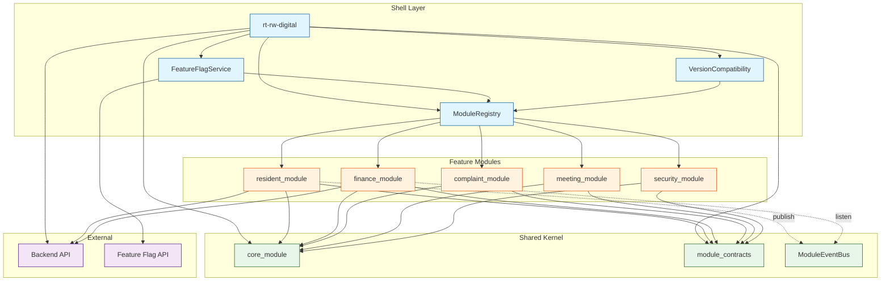
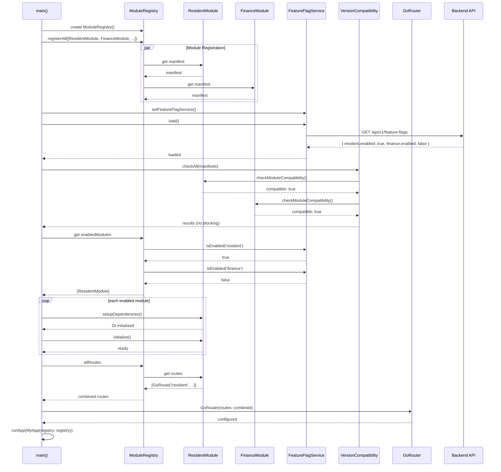
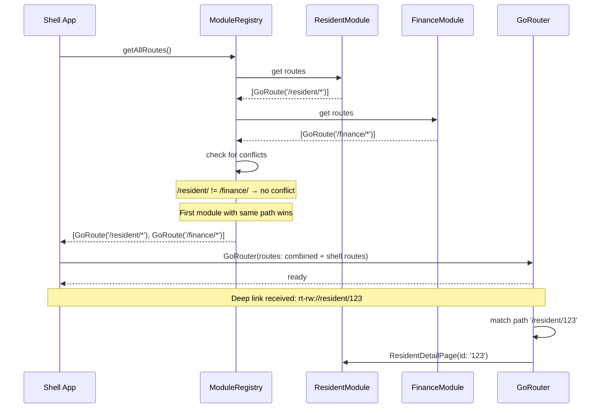
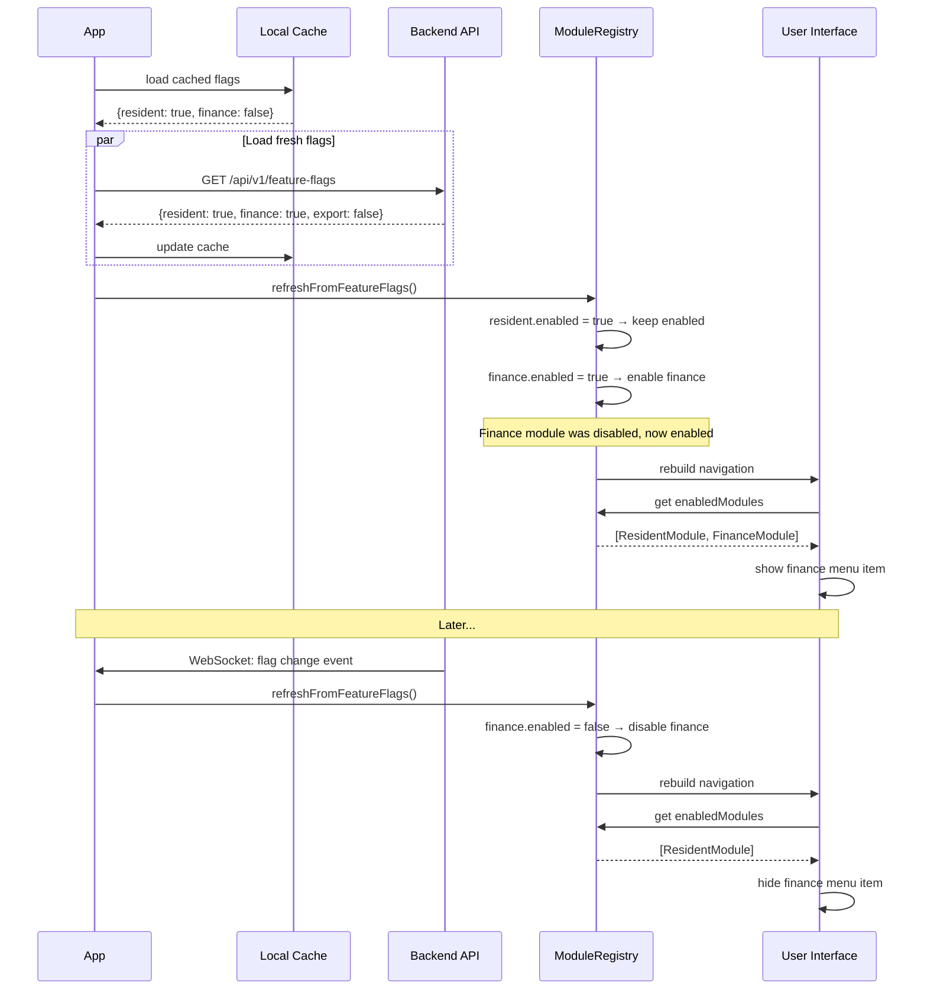
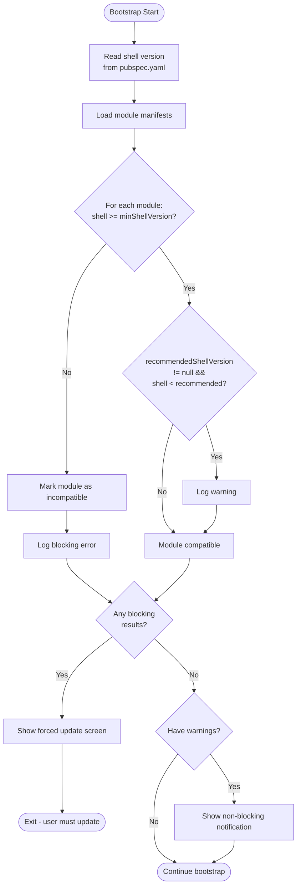
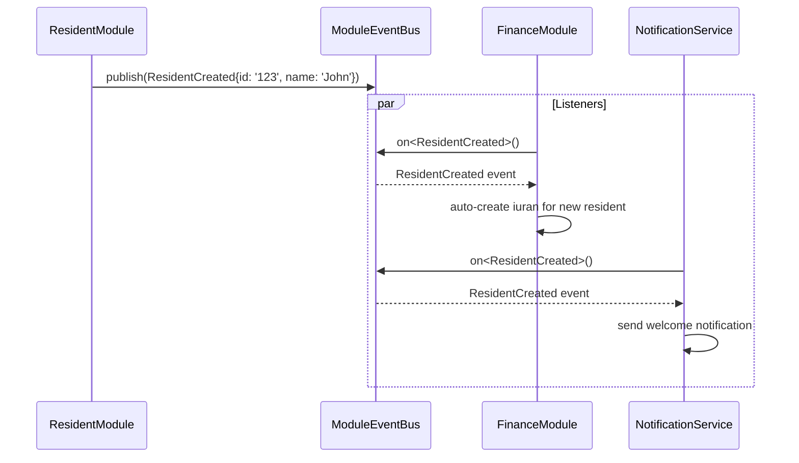

# Mermaid Architecture Diagrams

## 1. Dependency Graph



## 2. Bootstrap Flow



## 3. Module Lifecycle

```mermaid
stateDiagram-v2
    [*] --> Registered : ModuleRegistry.register()
    
    Registered --> DependenciesSetup : FeatureModule.setupDependencies()
    
    DependenciesSetup --> Initialized : FeatureModule.initialize()
    
    Initialized --> Active : FeatureFlags enabled
    Initialized --> Inactive : FeatureFlags disabled
    
    Active --> Inactive : Flag changed to disabled
    Inactive --> Active : Flag changed to enabled
    
    Active --> Error : initialize() throws
    Error --> [*] : Module removed from registry
    
    Inactive --> [*] : Module unregistered
    
    state Active {
        [*] --> RoutesExposed
        RoutesExposed --> HandlingNavigation
        HandlingNavigation --> RoutesExposed
    end
```

## 4. Route Registration Flow



## 5. Feature Flag Flow



## 6. Version Compatibility Flow



## 7. Module Communication Flow (Event Bus)



## 8. AI-Agent Module Generation Flow

```mermaid
flowchart LR
    PROMPT[AI Agent Prompt] --> TEMPLATE[Module Template]
    TEMPLATE --> GENERATE{AI Agent\ngenerates}
    
    GENERATE --> MODULE[FeatureModule impl]
    GENERATE --> MANIFEST[ModuleManifest]
    GENERATE --> ROUTES[Route defs]
    GENERATE --> DOMAIN[Domain entities]
    GENERATE --> REPO[Repository interface]
    GENERATE --> IMPL[Repository impl]
    GENERATE --> UI[UI Pages]
    GENERATE --> TESTS[Test files]
    GENERATE --> YAML[module_manifest.yaml]
    
    MODULE --> REGISTER[Register in shell]
    MANIFEST --> REGISTER
    ROUTES --> REGISTER
    
    REGISTER --> VERIFY{Verify:}
    VERIFY --> V1[Routes work?]
    VERIFY --> V2[Flags respected?]
    VERIFY --> V3[Tests pass?]
    VERIFY --> V4[Boundaries clean?]
    
    V1 -->|Yes| DONE([Module ready])
    V2 -->|Yes| DONE
    V3 -->|Yes| DONE
    V4 -->|Yes| DONE
